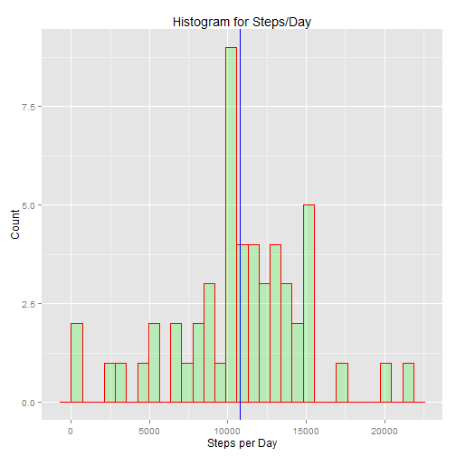
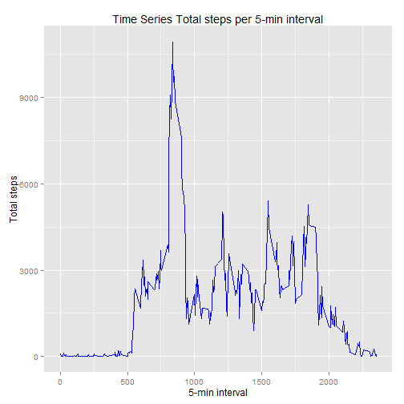
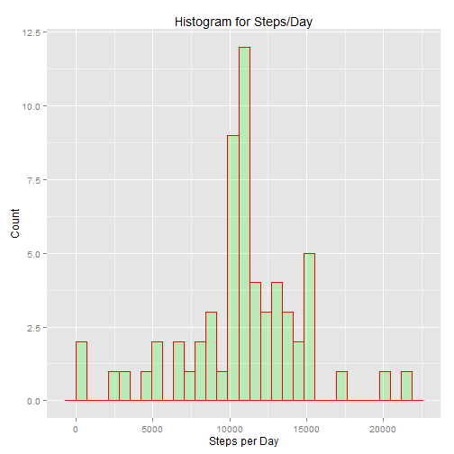
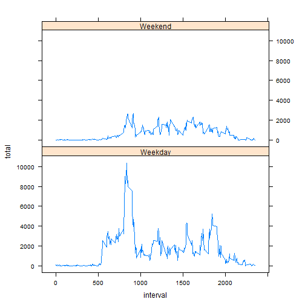

## Loading and preprocessing the data


```r
if(!file.exists("./data")){dir.create("./data")}
#fileURL <- "http://d396qusza40orc.cloudfront.net/repdata%2Fdata%2Factivity.zip"
#download.file(fileURL,destfile= "./data/activity.csv")
#unzip(zipfile="./data/repdata-data-activity.zip",exdir="./data")
activity <- read.csv("./data/activity.csv")
```

##What is mean total number of steps taken per day?


```r
library(dplyr)
```

```
## Warning: package 'dplyr' was built under R version 3.1.3
```

```
## 
## Attaching package: 'dplyr'
## 
## The following object is masked from 'package:stats':
## 
##     filter
## 
## The following objects are masked from 'package:base':
## 
##     intersect, setdiff, setequal, union
```

```r
library(ggplot2)
```

```
## Warning: package 'ggplot2' was built under R version 3.1.3
```

```r
library(lattice)

#Calculate total number of steps taken per day (ignore steps = NA)

activity1 <- activity %>% filter(is.na(steps) == FALSE )
activity1 <- activity1 %>% group_by(date) %>% summarize (total = sum(steps))

# Histogram to plot Total number of steps taken per day 
plt <- ggplot(activity1, aes(total)) + 
  geom_histogram(col= "red", fill = "green" , alpha = 0.2) + 
  labs (x = "Steps per Day", y = "Count", title="Histogram for Steps/Day")
plt
```

 

```r
#Calculate and report the mean and median of the total number of 
#steps taken per day
meanstep <- mean(activity1$total)
medianstep <- median(activity1$total)

#Mean Step is:
meanstep
```

```
## [1] 10766.19
```

```r
#Median Step is:
medianstep
```

```
## [1] 10765
```

```r
#Plot Mean on the Histogram of Steps/Day
plt + geom_vline(xintercept = c(mean(activity1$total),median(activity1$total)), colour="blue")
```

 

```r
maxsteps <- activity1 %>% filter (total == max(total)) 
maxsteps
```

```
## Source: local data frame [1 x 2]
## 
##         date total
## 1 2012-11-23 21194
```

##What is the average daily activity pattern?

```r
#Calculate the steps/interval

activity1 <- activity[complete.cases(activity),]
activity1 <- activity1 %>% group_by (interval) %>% summarize(total = sum(steps))

#Plot 5-min interval vs steps taken across all days
ggplot(activity1, aes(interval, total)) +geom_line(color = "blue") +
  labs(x = "5-min interval", y= "Total steps" ) +
  labs (title = "Time Series Total steps per 5-min interval")
```

 

```r
# Determine which 5-minute interval contains the maximum number of steps
maxinterval <- activity1 %>% filter (total == max(total)) %>% select(interval)
maxinterval
```

```
## Source: local data frame [1 x 1]
## 
##   interval
## 1      835
```

## Inputting Missing values


```r
# Calculate and report the total number of missing values in the dataset
nrow(activity) - nrow(activity[complete.cases(activity),])
```

```
## [1] 2304
```

```r
#Input missing values - Mean of corressponding day will be plugged in

activity1 <- activity[complete.cases(activity),]
activity1 <- activity1 %>% group_by (interval) %>% summarize(total = mean(steps))
#Append a column with the 
mergeddata <- merge(activity, activity1, by = "interval")

#Identify rows with missing values
ind <- is.na(mergeddata$steps)

filleddata <- mergeddata
filleddata[ind,2] <- filleddata[ind,4]
filleddata <- filleddata[1:3]

# Calculate total number of steps taken per day
filleddata1 <- filleddata %>% group_by(date) %>% summarize (total = sum(steps))

# Histogram to plot Total number of steps taken per day 
plt <- ggplot(filleddata1, aes(total)) + 
  geom_histogram(col= "red", fill = "green" , alpha = 0.2) + 
  labs (x = "Steps per Day", y = "Count", title="Histogram for Steps/Day")
plt
```

 

```r
#steps taken per day
meanstep <- mean(filleddata1$total)
medianstep <- median(filleddata1$total)

#Mean Step is:
meanstep
```

```
## [1] 10766.19
```

```r
#Median Step is:
medianstep
```

```
## [1] 10766.19
```
What is the impact of imputing missing data on the estimates of the total daily number of steps?

There is not much impact after injecting the missing value.


```r
maxsteps <- filleddata1 %>% filter (total == max(total)) 
maxsteps
```

```
## Source: local data frame [1 x 2]
## 
##         date total
## 1 2012-11-23 21194
```
##Are there differences in activity patterns between weekdays and weekends?


```r
# Determine if Date is a weekday or weekend
tempdata <- filleddata
tempdata$weekend <- ifelse(weekdays(as.Date(filleddata$date)) %in% c("Saturday", "Sunday"), "Weekend", "Weekday")
tempdata <- tempdata %>% group_by (interval,weekend) %>% summarize(total = sum(steps))
head(tempdata)
```

```
## Source: local data frame [6 x 3]
## Groups: interval
## 
##   interval weekend       total
## 1        0 Weekday 101.3018868
## 2        0 Weekend   3.4339623
## 3        5 Weekday  20.0377358
## 4        5 Weekend   0.6792453
## 5       10 Weekday   7.7924528
## 6       10 Weekend   0.2641509
```

```r
# Panel plot containing a time series plot (i.e. type = "l") of the 
#5-minute interval (x-axis) and the average number of steps taken

xyplot(total ~ interval | weekend, data = tempdata, layout = c(1, 2), type = "l")
```

 

